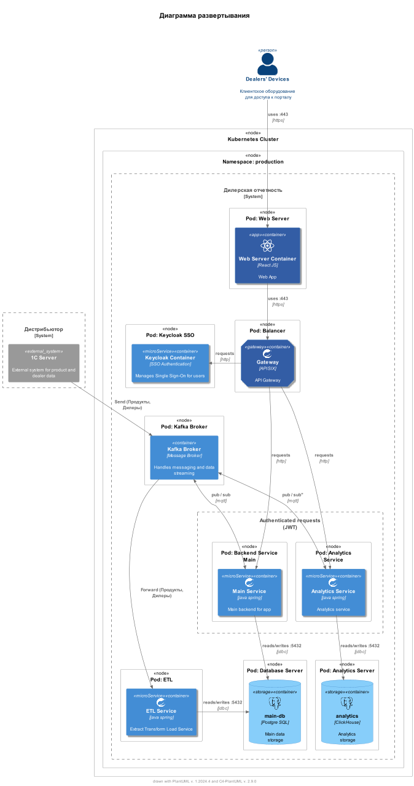

# Диаграмма Развертывания: Система Отчетности на Kubernetes

## Внешние Системы

- **Dealers' Devices**: Устройства дилеров, используемые для доступа к порталу через веб-браузер.
- **1C Server**: Внешний сервер с системой 1С, который управляет данными о продуктах и дилерах.

## Kubernetes Cluster

### Namespace: production

#### Pods

**`Pod: Web Server`** / **`Web Server Container`**
> Веб-приложение, обрабатывающее веб-запросы (`REST API`) и обслуживающее портал.

**`Pod: Backend Service Main`** / **`Main Service`**
> Бекенд-сервис, обрабатывающий API-запросы и бизнес-логику.

**`Pod: Analytics Service`** / **`Analytics Service`**
> Бекенд-сервис, отвечающий за обработку аналитических запросов.

**`Pod: Database Server`** / **`Database Container`**
> OLTP База данных для хранения транзакционных данных.

**`Pod: Analytics Database`** / **`ClickHouse Container`**
> Колоночная СУБД для аналитики, используемая для хранения данных для отчетов.

**`Pod: Kafka Broker`** / **`Kafka Broker Container`**
> Мессенджер для обработки сообщений и потоков данных.

**`Pod: ETL Service`** / **`ETL Container`**
> Сервис для обработки, трансформации и загрузки данных.

**`Pod: Report Service`** / **`Report Service Container`**
> Сервис для генерации и предоставления отчетов.

**`Pod: Keycloak SSO`** / **`Keycloak Container`**
> Контейнер для управления аутентификацией пользователей через SSO (Single Sign-On).

**`Pod: Balancer`** / **`Gateway Container`**
> Контейнер для управления входящим трафиком к сервисам.

